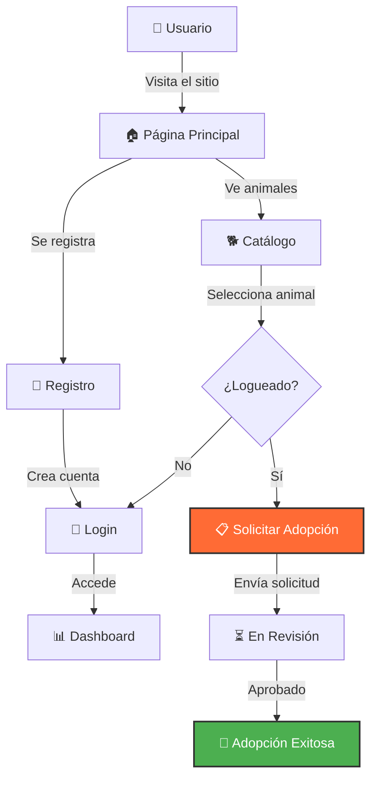

<table>
  <tr>
    <td width="150">
      <h1 style="font-size: 80px; margin: 0;">🐾</h1>
    </td>
    <td>
      <h1>Centro de Adopción de Animales</h1>
      <em>"Encuentra a tu compañero perfecto"</em>
    </td>
  </tr>
</table>


## 💡 Sobre el Centro de Adopción

**Centro de Adopción de Animales** es una plataforma web diseñada para conectar animales que necesitan un hogar con familias amorosas. El sistema permite a los usuarios registrarse, explorar animales disponibles y solicitar adopciones.

### ✨ Características Principales

* **Catálogo de Animales** - Visualiza perros, gatos y más
* **Sistema de Adopción** - Solicita adopciones fácilmente
* **Perfiles de Usuario** - Dashboard personalizado
* **Estado en Tiempo Real** - Seguimiento de solicitudes

### 🔄 Flujo de Adopción



---

## ✨ Características Destacadas

| ⚡ Funcionalidad | 📌 Detalle |
|-----------------|-----------|
| **Galería de Animales** | Muestra fotos, raza, edad y descripción |
| **Filtros Inteligentes** | Busca por especie, tamaño o edad |
| **Sistema de Solicitudes** | Proceso de adopción digitalizado |
| **Panel de Usuario** | Gestiona tus solicitudes y perfil |
| **Diseño Responsive** | Funciona en cualquier dispositivo |

---

## 🎨 Badges & Estado


---

## ⚙️ Instalación y Configuración

### 1️⃣ Clonar el Repositorio

```bash
git clone https://github.com/JoseEduardoGR/Centro-Adopcion-Animales.git
cd Centro-Adopcion-Animales
```

### 2️⃣ Configurar Base de Datos

Crea la base de datos e importa el esquema:

```sql
CREATE DATABASE centro_adopcion;
USE centro_adopcion;
-- Importar el esquema desde config/
```

### 3️⃣ Configurar Conexión

Edita `config/database.php`:

```php
private $host = "localhost";
private $db_name = "centro_adopcion";
private $username = "tu_usuario";
private $password = "tu_password";
```

### 4️⃣ Iniciar Servidor

```bash
php -S localhost:8000
```

Abre `http://localhost:8000` en tu navegador.

---

## 📂 Estructura del Proyecto

```
CENTRO-ADOPCION/
├── assets/
│   ├── css/
│   │   └── style.css        # Estilos principales
│   └── js/
│       └── script.js        # Scripts del frontend
├── config/
│   ├── database.php         # Conexión a BD
│   └── session.php          # Manejo de sesiones
├── public/
│   └── images/              # Imágenes de animales
├── adopt_animal.php         # Procesar adopción
├── cancel_adoption.php      # Cancelar solicitud
├── dashboard.php            # Panel de usuario
├── index.php                # Página principal
├── login.php                # Inicio de sesión
├── logout.php               # Cerrar sesión
├── register.php             # Registro de usuarios
├── update_profile.php       # Actualizar perfil
├── LICENSE                  # Licencia MIT
└── README.md                # Este archivo
```

---

## 🐾 Tipos de Animales

| Especie | Descripción |
|---------|-------------|
| 🐕 **Perros** | Diversas razas y tamaños |
| 🐱 **Gatos** | Gatitos y adultos |
| 🐰 **Conejos** | Mascotas pequeñas |
| 🐦 **Aves** | Especies domésticas |

---

## 🛠️ Tecnologías Utilizadas

| Tecnología | Uso |
|------------|-----|
| **PHP 8+** | Backend |
| **MySQL** | Base de datos |
| **PDO** | Conexiones seguras |
| **CSS3** | Diseño visual |
| **JavaScript** | Interactividad |

---

## 🏆 Créditos

**JoseEduardoGR** – Desarrollo y diseño.

💻 Proyecto educativo de preparatoria.

---

## 📄 Licencia

Este proyecto está bajo la **Licencia MIT** - ver el archivo [LICENSE](LICENSE) para más detalles.

---

<div align="center">
  <p>🐾 Hecho con ❤️ por <a href="https://github.com/JoseEduardoGR">JoseEduardoGR</a></p>
  <p>Ayudando a conectar mascotas con familias amorosas</p>
</div>
